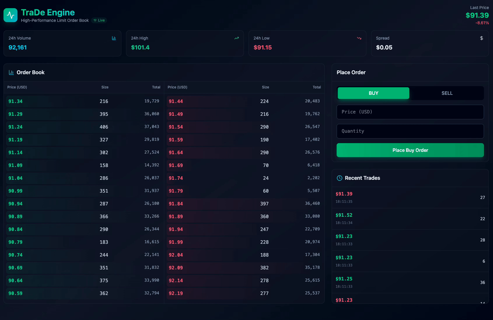
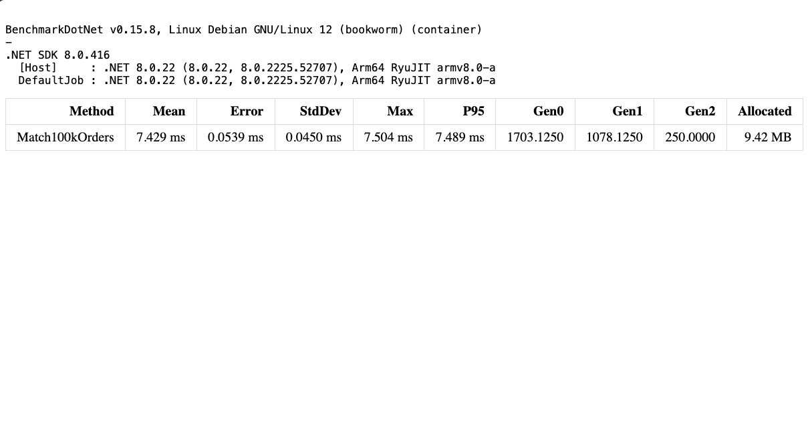
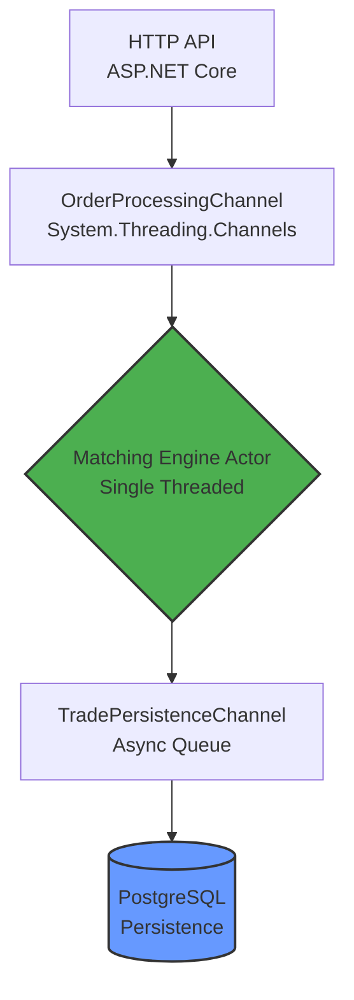

<h1 align="center"> TraDe </h1>

<div align="center">

[](https://github.com/OldManny/TraDe/actions/workflows/dotnet-ci.yml)


</div>

<div align="center">
    
</div>

---

## Overview

**TraDe** is a high-performance, low-latency **Limit Order Book (LOB)** implemented in **.NET 8**, featuring a real-time **React** dashboard.

The project explores how far a **single-threaded matching engine**, combined with efficient data structures and asynchronous I/O boundaries, can be pushed before introducing horizontal complexity.

Rather than optimizing for premature scalability, the system prioritizes:
- Throughput
- Latency determinism
- Observability
- Clear separation between hot and cold paths

---

## Core Design Principles

### Single-Threaded Matching Engine
The matching engine follows an **actor-style execution model** using `System.Threading.Channels`.

- One dedicated consumer processes orders sequentially
- No locks on the hot path
- No shared mutable state
- Deterministic execution order

Eliminates contention and GC pressure typically introduced by multi-threaded order matching.

---

### Price–Time Priority (FIFO)
Orders are matched using strict **price-time priority**, implemented with:

- `SortedDictionary<decimal, LinkedList<Order>>` for price levels
- FIFO ordering within each price level
- O(log n) insertion and lookup

Closely mirrors how real-world exchanges structure their core order books.

---

### Asynchronous Persistence
Persistence is intentionally **decoupled** from the matching engine.

- Trades are emitted to a dedicated channel
- Batched writes to PostgreSQL via EF Core
- Matching latency is unaffected by I/O

This separation makes sure that the hot path remains CPU-bound and predictable.

---

## Performance Characteristics

*Benchmarked on Apple M1 Pro (16GB RAM)*

- **Throughput:** ~13.2 million matches / second  
- **Mean Latency:** ~75 nanoseconds  
- **P95 Latency:** ~75 nanoseconds
- **Max Latency**: ~75 nanosecond 
- **Memory Usage:** ~94 bytes per order  

These results demonstrate the effectiveness of:
- Single-threaded execution
- Allocation-aware data structures
- Avoidance of synchronization primitives

Benchmarks are implemented using **BenchmarkDotNet** and run against the core matching logic in isolation.

<div align="center">
    
</div>

---

## System Architecture

<div align="center">


</div>

---

## Infrastructure & Deployment

The system is fully containerized and deployed to **Kubernetes** using **Terraform**.

### Tooling
- Docker
- Kubernetes
- Terraform
- PostgreSQL
- Node.js

### Deployment Flow
```bash
# 1. Prepare environment variables
cp .env.example .env

# 2. Build the application image
docker build -t trade-engine:v1 -f TraDe.Server/Dockerfile .

# 3. Deploy infrastructure and workloads
cd infra
terraform init
terraform apply

# 4. Local Development
dotnet run --project TraDe.Server

cd trade-ui
npm install
npm run dev
```

Infrastructure is intentionally kept minimal to maintain clarity and focus on system behavior rather than platform complexity.

---

## Observability (Planned)

Planned additions include:
- Prometheus metrics for:
    * Matching latency
    * Queue depth
    * Orders/sec
    * Persistence lag
- Grafana dashboards for real-time visualization
- Optional OpenTelemetry tracing

These will provide visibility into both performance and system health.

---

## Roadmap
- [x] Phase 1: Solution setup & core domain
- [x] Phase 2: In-memory order book logic (Price-Time Priority)
- [x] Phase 3: Concurrency layer (High-speed Channels)
- [x] Phase 4: Async persistence (PostgreSQL)
- [x] Phase 5: API & market data simulation
- [x] Phase 6: Infrastructure Orchestration (K8s/Terraform)
- [ ] **Next:** Real-time Visualizations (SignalR & Grafana)

---

## Notes on Production Hardening

This project intentionally focuses on core engine behavior.

For a production deployment, additional considerations would include:
- Remote Terraform state backends
- Kubernetes resource limits and security contexts
- Network policies and RBAC
- External secret management
These are intentionally deferred to avoid obscuring the core system design.

---

## License

This project is provided for educational and experimental purposes.